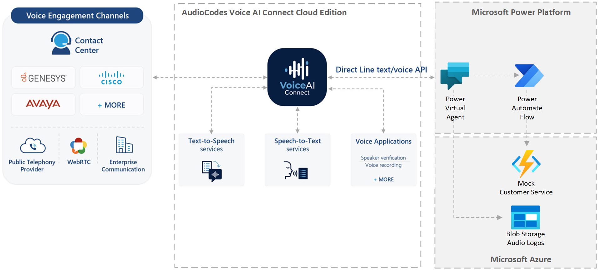
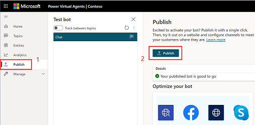

# Contact Center Accelerator

The goal of a modern contact center solution is to provide a customer experience that rivals
that of an experienced human agent and do that at scale and at a fraction of the cost of a
traditional contact center.  Achieving that goal requires a solution that can transform
conversation into a coordinated business process that weaves together a core set of solution
elements to respond effectively. This solution accelerator provides the building blocks and
blueprint for how to use Power Virtual Agent and AudioCodes VoiceAI Connect Cloud Edition
to build a modern contact center assistant.

## Modern Contact Center Solution

A modern contact center solution involves the effective integration of the key systems and
services shown in **Figure 1**. The primary goal of this accelerator is to identify these
systems and services and show how each can be effectively integrated into a modern contact
center solution to provide maximum capability. To accomplish this goal, the accelerator
includes a set of building blocks and blueprints that address common contact center tasks
and scenarios.  You can think of the systems and services in **Figure 1** as sort of a
checklist of key topic areas you need to give careful consideration to build an effective
modern contact center solution.

#### <a name="HighLevelSubsystemOverview"></a>Figure 1: Contact Center Core Elements


[give a brief explanation of each core element and what role it plays and the opportunity
it offers in terms of capability]

## Solution Overview

In the context of a contact center, two disciplines weave each of the various solution
elements together and bring them alive: conversational AI and telephony.  In this
accelerator, conversational AI discipline is provided by Microsoft's Power Virtual Agent
(PVA) and telephony is provided by AudioCodes VoiceAI Connect Cloud (VAIC-C).  Figure 2
provides an architectural understanding of how those two technologies fit together along
with the other elements of the accelerator.  In this initial version of the accelerator,
only 4 of the 7 core elements of Figure 1 are addressed: Contact Center Assistant,
Experiences, Customer Services, and Line of Business Integration.  The other 3 will be
addressed as this accelerator evolves.



[give brief description of the diagram]

## Using the Accelerator

Think of this accelerator as part construction kit and part roadmap where its building
blocks and scenarios allow you to minimize time-to-value and maximize solution
capability.
 
**Building Blocks** - The accelerator includes a set of executable how-to's that
provide "implementation snippets" for various common contact center tasks.  You can use
them "as is" or tailor and extend them to meet the needs of your solution.  
**Scenarios** - The scenarios included in the accelerator are example implementations
of common contact center scenarios like "order status" or "product trouble
shooting".  
**Best Practices** - Finally, the best practices discuss important contact center
topics and provide insight and effective approaches for addressing contact center
challenges.

## 

### <a name="Prerequisites"></a>Prerequisites

**Required Skills**  
If this accelerator is going to be used as a telephony demonstration, then only a
basic understanding of Microsoft's Power Virtual Agent (PVA) is required and the
instructions for configuring AudioCode's VoiceAI Connect Cloud (VAIC-C) should be
enough to accomplish the task without any prior knowledge.

If this accelerator is going to be used to accelerate the development and
deployment of a modern contact center solution, then a good working knowledge
of PVA and VAIC-C will be required for tasks that involve creating and extending
PVA Topics, PVA Composer Topics, Power Automate Flows, Azure Functions, and
understanding the various VAIC-C capabilities and how to integrate them.  If you
are new to PVA and/or AudioCodes VoiceAI Connect, this accelerator can be very
helpful in getting you up to speed with less effort since you'll start with an
assistant that has an implementation that you can examine and extend so you
aren't starting from first principles.

**Subscriptions**  
You don't need to be a developer or have development tools installed in order to
get this accelerator up and running and demo it but you will if you wanted to
modify and extend this accelerator (see [For Developers](#ForDevelopers) section
for details). The only thing you need to run this accelerator and try it out is
access to Microsoft's Power Virtual Agent and AudioCodes VoiceAI Connect Cloud
Edition. If you don't already have access to either of those services, you can
create a trial account to explore those services and this accelerator.

Note: Some of the capabilities of this accelerator require AudioCodes VoiceAI
Connect Cloud Edition Plus and you can upgrade your service later if you want to
leverage those features without having to reinstall the accelerator.  

- **Get PVA Trial Account**  
To sign up for a free trial account for Power Virtual Agents click [here](https://go.microsoft.com/fwlink/?LinkId=2107702&clcid=0x409&cmpid=pva-home-hero-sta-buildchatbots)

- **Get AudioCodes Trial Account**  
Follow the instructions [here](https://techdocs.audiocodes.com/voice-ai-connect/#VAIG_Cloud/signing_up_to_cloud.htm?TocPath=VoiceAI%2520Connect%2520Cloud%257C_____2)
to sign up for a free trial account for AudioCodes Voice AI Connect Cloud
Edition.  
&nbsp;  
Alternatively, you can also subscribe to AudioCodes Voice AI Connect Cloud
Edition from Azure Market Place by following the instructions [here](https://techdocs.audiocodes.com/voice-ai-connect/#VAIG_Combined/Accessing%20VoiceAi%20Connect%20Cloud%20from%20Azure.htm?TocPath=VoiceAI%2520Connect%2520Cloud%257C_____1)

<a name="ForDevelopers"></a>**Development Tools**  
Although the following development tools are not required in order to get this
accelerator up and running and demo it, they are required if you want to explore
or extend the more advanced and technical aspects of this accelerator.
Currently, the technical developer-oriented aspects of this accelerator are its
mock Customer Service which is a very, very, simple Azure Function and a number
of PVA Composer Topics.   
- **Install Bot Framework Composer**  
This accelerator extends its Power Virtual Agent by using Bot Framework Composer
and you'll need to install it if you want to explore or modify those
extensions.  You can install the Bot Framework Composer by clicking [here](https://docs.microsoft.com/en-us/composer/install-composer?tabs=windows)

- **Install Visual Studio**  
If you want to explore the mock Customer Service Azure Function or if you
installed Composer to explore or extend PVA Composer Topics, you'll also
need to install Visual Studio which can be installed [here](https://docs.microsoft.com/en-us/visualstudio/install/install-visual-studio?view=vs-2022)

### <a name="GettingStarted"></a>Getting Started
Getting started should be quick and easy and there are only four steps you
need to complete which are explained well enough that you shouldn't need
any prior knowledge to be successful.
1) **Clone the PVA/AudioCodes Contact Center Repo**  
The [PVA/AudioCodes Contact Center Accelerator repo](https://github.com/managedcoder/PVAAudioCodesCC)
has everything you'll need to get the solution up and running and to get
started you'll need to clone the repo with the following console command:  
&nbsp;  
```git clone https://github.com/managedcoder/PVAAudioCodesCC```  

2) **Deploy Mock Services**  
In order to capture realistic enterprise scenarios for a modern contact
center, this accelerator implements mock services and hosts sample audio
logo files.  To make it as easy as possible to get up and running quickly
without having to understand the technical details of the accelerator, a
single PowerShell script is provided that will deploy and configure these
mock services and all you'll need to do it run it.  
&nbsp;  
Open a Power Shell command window with its current working directory set
to the **Deployment** project folder and sign into your Azure subscription
if you haven't already  
&nbsp;  
```az login```  
&nbsp;  
Running the following command will deploy the mock services used by this
accelerator.  You can delete these services once they've served their
purpose of providing an explicit blueprint/roadmap for building a modern
contact center.  
&nbsp;  
```.\deploy.ps1 -name "<name>" -location "<region>"```  
&nbsp;  
Where:  
**```<name>```** is the name to use to deploy the accelerator's mock
services.  For example, you could use some form of your contact center
assistant's name using letters and numbers that's between 3 and 24
characters long (e.g., ```"ContosoMockServices"```).  
**```<region>```** is the Azure region where the mock services will
be deployed (e.g., ```"eastus"```).  
&nbsp;  
The deployment generally only takes about a minute to complete and when
it's done you'll see two important configuration settings in yellow that
you'll need to come back and copy later when you get to the configuration
step for your contact center assistant.  
&nbsp;  
**Note:** If there are errors during deployment, you'll see them in the
command window and more detailed error information will be written to a
log file named deploy_log.txt.

3) **Import, Configure & Deploy the PVA Contact Center Accelerator Solution**  
The accelerator's contact center assistant has been shared as a Power
Virtual Agent solution that will need to be imported into your Power
Virtual Agent environment.  
&nbsp;  
***Import Solution***  
To import the assistant, skip to the 1:48 minute mark of
[this short video](https://www.microsoft.com/en-us/videoplayer/embed/RE4CsHl?postJsllMsg=true)
which will explain how to import a solution or follow the instructions
[here](https://docs.microsoft.com/en-us/power-virtual-agents/authoring-export-import-bots#import-the-solution-with-your-bot).  
&nbsp;  
The solution zip file is called PVAAudioCodesContactCenterAccelerator_1_0_0_0.zip
and can be found in the root project folder.  
&nbsp;  
The last part of the video shows you how to browse to the imported
assistant or you can browse to the [PVA portal](https://web.powerva.microsoft.com)
and open the imported assistant by clicking on the bot icon in the upper
right corner of the page and choose your assistant from the menu.  
&nbsp;  
  
&nbsp;  
***Configure Your Assistant's Greeting***  
To connect your contact center assistant to the accelerator's mock
services, there is a simple configuration step you'll need to complete.  
&nbsp;  
Click the **Topics** tab in the left navigation and find the **Greeting**
topic in the list of Topics (use Search box if needed) and click on it
to open it.  There are three values you'll need to set in the **Redirect**
action for **configureMockSettings**.  The copy and paste the first two
from the corresponding settings displayed in yellow text at the end of the
deployment in the deployment command window (**customerServiceHostURL**
and **audioLogoURL**).  For the **agentPhoneNumber** setting you can
use the phone number you would like the assistant to call when agent
escalation occurs.  There are several places in the building
blocks and scenarios that escalate to an agent and when that happens
the phone number you provide in this setting will be called.  Using
your cell phone number is a convenient way to test and demo this.  
  
***Publish Your Assistant***  
Finally, publish your assistant by clicking the **Publish** tab in the
left navigation menu and then click the **Publish** button  
&nbsp;    
  
4) **Telephony Configuration**  
Configuring the telephony aspect of the solution accelerator involves
working in AudioCodes VoiceAI Connect Cloud portal  
&nbsp;  
***Create Telephony Bot Definition***  
Follow the instructions [here](https://techdocs.audiocodes.com/voice-ai-connect/#VAIG_Cloud/ms_power_va.htm?TocPath=VoiceAI%2520Connect%2520Cloud%257CCreating%2520your%2520bot%2520using%2520Bot%2520Integration%2520wizard%257C_____1)
to create a telephony bot definition in the AudioCodes VoiceAI Connect
portal and set its configuration as you see below  
&nbsp;  
***Bot Details Tab***  
  
&nbsp;  
***Bot Setting Tab***  
  
&nbsp;  
***Bot Features Tab***  
  
&nbsp;  

### <a name="ExploreContactCenterSolutionAccelerator"></a>Explore Contact Center Solution Accelerator
The accelerator is spread across several portals and a number of
assets so [this video gives a quick tour](http://aka.ms/pva-vaicc-tour)
of all its various elements and should prepare you to be able to
effectively explore on you own.

### <a name=""></a>Gotcha's To Be Aware Of
- **Version Confusion** - Use version numbers in PVA and Composer
Topics so you can ask for them when you test you contact center
assistant.  Anytime you change a Composer topic you will need to
1) refresh the PVA portal page and 2) republish your contact center
assistant, otherwise, AudioCodes VoiceAI Connect Cloud (VAIC-C) will
still be pointing to the last published version.  Even more
confusing is that the Test Panel in the PVA portal works fine since
it points to the most up-to-date unpublished version.

- More to come soon!

### <a name="AddOrExtendComposerTopics"></a>Add or Extend Composer Topics  
Coming soon!

### <a name="TelephonyUserExperienceChallengesAndBestPractices"></a>Telephony User Experience Challenges and Best Practices  
Coming soon!

### <a name="CapturingCustomerInsight"></a>Capturing Customer Insight  
Coming soon!

### <a name="MultiModalCustomerEngagement"></a>Multi-modal Customer Engagement  
Coming soon!
