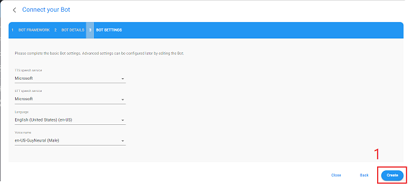

# Contact Center Accelerator

The goal of a modern contact center solution is to provide a customer experience that rivals that of
an experienced human agent and do that at scale and at a fraction of the cost of a traditional
contact center.  Achieving that goal requires a solution that can transform conversation into a
coordinated business process that weaves together a core set of solution elements to respond
effectively. This solution accelerator provides the building blocks and blueprint for how to use Power
Virtual Agent and AudioCodes VoiceAI Connect Cloud Edition to build a modern contact center assistant
consistent with contact center best practices.

## Modern Contact Center Solution

A modern contact center solution involves the effective integration of a number of key systems and
services.  Identifying these key sytems and services and understanding how each fits into the
overall solution is critical for maximizing contact center capability.  Figure 1 uses blue circles
to identify these key systems and services as core contact center elements.  The building blocks
and blueprints in this accelerator address common contact center tasks and scenarios and each
involve one or more of these core solution elements.  You can think of the core elements in
figure 1 as sort of a checklist of key topic areas you need to give careful consideration to
in order to build a modern contact center solution.

#### <a name="HighLevelSubsystemOverview"></a>Figure 1: Contact Center Core Elements


[give a brief explanation of each core element and what role it plays and the opportunity it
offers in terms of capability]

## Solution Overview

In the context of a contact center, two disciplines weave each of the various solution elements
together and bring them alive: conversational AI and telephony.  In this accelerator, converational
AI discipline is provided by Power Virtual Agent and telephony is provided by AudioCodes VoiceAI
Connect Cloud.  Figure 2 provides an architectual understanding of how those two technologies fit
together along with the other elements of the accelerator.  In this initial version of the
accelerator, only 4 of the 7 core elements of Figure 1 are addressed: Contact Center Assistant,
Experiences, Customer Services, and Line of Business Integration.  The other 3 will be addressed
as this accelerator evolves.


[give brief description of the diagram]

## Building a Modern Contact Center

This accelerator has three primary building blocks: executable how-to's, scenarios, and best practices.
The executable how-to's provide "implementation snippets" for various contact center tasks.  You can
use them "as is" or tailor and extend them to meet the needs of your solution.  The scenarios included
in the accelerator provide a blueprint for how the various elements in a contact center solution can be
stitched together to implement common contact center use cases. Finally, the best practices discuss
important contact center topics and provide insight and effective approaches for addressing contact
center challenges.

## 

### <a name="Prerequisites"></a>Prerequisites

**Skills**  
This accelerator assumes the implementor has the following basic skills...

**Subscriptions**  
This accelerator requires the developer to have access to Power Virtual Agent and AudioCodes VoiceAI
Connect Cloud Edition Plus.  If you don't already have access to either of these you can create a
trial account to explore those services and this accelerator.

- **Get PVA Trial Account**  
&nbsp;  
To sign up for a free trial account for Power Virtual Agents click [here](https://go.microsoft.com/fwlink/?LinkId=2107702&clcid=0x409&cmpid=pva-home-hero-sta-buildchatbots)

- **Get AudioCodes Trial Account**  
&nbsp;  
Follow the instructions [here](https://techdocs.audiocodes.com/voice-ai-connect/#VAIG_Cloud/signing_up_to_cloud.htm?TocPath=VoiceAI%2520Connect%2520Cloud%257C_____2)
to sign up for a free trial account for AudioCodes Voice AI Connect Cloud Edition.  
&nbsp;  
Alternatively, you can also subscribe to AudioCodes Voice AI Connect Cloud Edition from Azure Market
Place by following the instructions [here](https://techdocs.audiocodes.com/voice-ai-connect/#VAIG_Combined/Accessing%20VoiceAi%20Connect%20Cloud%20from%20Azure.htm?TocPath=VoiceAI%2520Connect%2520Cloud%257C_____1)

#### Install Bot Framework Composer

This accelerator extends its Power Virtual Agent by using Bot Framework Composer and thus it needs to
be installed to explore those extensions.  You can install the Bot Framework Composer by click
[here](https://docs.microsoft.com/en-us/composer/install-composer?tabs=windows)


### <a name="GettingStarted"></a>Getting Started

1) **Clone the PVA/AudioCodes Contact Center Repo**  
The PVA/AudioCodes Contact Center Accelerator repo has everything you'll need to get the solution
up and running and to get started you'll need to clone the repo with the following console command:  
&nbsp;  
```git clone https://github.com/managedcoder/PVAAudioCodesCC```  

2) **Deploy Mock Services**  
Open a Power Shell command window with its current working directory set to the **Deployment** project
folder and sign into your Azure subscription if you haven't already  
&nbsp;  
```az login```  
&nbsp;  
Running the following command will deploy the mock services used by this accelerator and allow you to
demo/run all it's scenarios and how-to tasks.  You'll delete these services once they've served their
purpose of providing an explicit blueprint/roadmap for building a modern contact center.  
&nbsp;  
```.\deploy.ps1 -name "<name>" -location "<region>"```  
&nbsp;  
Where:  
**```<name>```** is the name to use to deploy the accelerator's mock services.  For example, 
you could use some form of your assistant's name using letters and numbers that's between 3 and 24 
characters long (e.g., ```"ContosoAssistant"```).  
**```<region>```** is the Azure region where the mock services will be deployed (e.g., 
```"eastus"```).  
&nbsp;  
**Note:** If there are errors during deployment, you'll see them in the command window and more detailed
error information will be written to a log file named deploy_log.txt.

3) **Import the PVA Contact Center Accelerator Solution**  
The PVA Contact Center Assistant has been shared as a Power Virtual Agent solution that will need
to be imported into your Power Virtual Agent environment. The easiest way to do that is to watch
[this short 2 minute video](https://www.microsoft.com/en-us/videoplayer/embed/RE4CsHl?postJsllMsg=true)
that explain how to import a solution or follow the instructions [here](https://docs.microsoft.com/en-us/power-virtual-agents/authoring-export-import-bots#import-the-solution-with-your-bot).
If you watch the video, you can skip past the initial discussion of how to export a solution to
finish this task faster.  
&nbsp;  
The solution zip is called PVAAudioCodesContactCenterAccelerator101_1_0_0_1.zip and can be found in
the root project folder.  
&nbsp;  
Once you've imported the solution, you can browse to the [PVA portal](https://web.powerva.microsoft.com)
and open it. 

4) **Host Audio Logos**  
Audio logos are identifiable sound effects used in marketing and branding and this accelerator shows
how to play and audio logo during the greeting when the call begins. The deployment script in the
previous step created an Azure Storage resource and preloaded it with two sample audio logos that can
be used to update the following PVA topics: **Greeting** and 
**HowToSendSSML**.  
&nbsp;  
To update those Topics, you'll first need to grab the URL of the audio logo from that Azure
Storage resource.  
  
Once you've copied the URL, you can use it to update the **vaicSendSSMLmessage** Redirect action in
those Topics and replace the URL string in the ```<audio>``` tag value of the ```ssml``` input
parameter.  


5) **Deploy Mock Customer Service**  
[Figure 1](#HighLevelSubsystemOverview) shows the core solution elements of a modern contact center
and some of the most common scenarios require integration with a customer service solution.
There are a number of popular commercial customer service solutions available and while each will
have its own integration APIs, the approach to calling those APIs from a PVA bot is the same and
this is demonstrated in this accelerator by using a mock, surrogate customer service represented by
the ```ContosoCustomerService``` Azure Function found in the ```PVAAudioCodesCC.sln``` solution.  
&nbsp;  
You'll need to deploy this mock customer service Azure function to explore and run some of the
scenarios included in this accelerator.  To deploy the mock customer service, open the
```PVAAudioCodesCC.sln``` and follow
[these instructions](https://docs.microsoft.com/en-us/azure/azure-functions/functions-create-your-first-function-visual-studio#publish-the-project-to-azure)
for using Visual Studio to deploy an Azure Function.

6) **Telephony Configuration**  
Configuring the telephony aspect of the solution accelerator involves working in both the AudioCodes
VoiceAI Connect Cloud portal and the PVA portal  
&nbsp;  
6.1) **Publish PVA Contact Center Assistant**  
Make sure your PVA assistant has been published in the PVA portal if you haven't done that already as part of
the previous import step.  
&nbsp;  
6.2 **Create Telephony Bot Definition**  
Follow the instructions [here](https://techdocs.audiocodes.com/voice-ai-connect/#VAIG_Cloud/ms_power_va.htm?TocPath=VoiceAI%2520Connect%2520Cloud%257CCreating%2520your%2520bot%2520using%2520Bot%2520Integration%2520wizard%257C_____1)
to create a telephony bot definition in the AudioCodes VoiceAI Connect portal and set its configuration
as you see below  
6.2.1 **Bot Details Tab**  
  
6.2.2 **Bot Setting Tab**  
  
6.2.3 **Bot Features Tab**  
  
6.3 **Change Settings of PVA Topic Actions**  
The following PVA Topics will need to be update now that the accelerator is setup: HowToMakeOutboundCall,
HowToTransferCall, HowToSendSSML, and Greeting.  The first two need the numberToCall to be update with
the number you want to use.  In our testing, we've been able to set it to our personal cell phone number
and use the "call waiting" feature of our cell phone to see the call coming in and even answer it.  We
can't be sure this works with all cell phone carriers.  
&nbsp;  
The last two Topics need to update the URL to point to the audio files you uploaded to Blob Storage.

### <a name="ExploreContactCenterSolutionAccelerator"></a>Explore Contact Center Solution Accelerator
The accelerator is spread across several portals and a number of assets so [this video gives a quick
tour](http://aka.ms/pva-vaicc-tour) of all its various elements and should prepare you to be able to
effectively explore on you own.

### <a name=""></a>Gotcha's To Be Aware Of
- **Version Confusion** - Use version numbers in PVA and Composer Topics so you can ask for them when you
test you assistant.  Anytime you change a Composer topic you will need to 1) refresh the PVA portal page
and 2) republish the PVA assistant otherwise AudioCodes VoiceAI Connect Cloud (VAIC-C) will still be
pointing to the last published version.  Even more confusing is that the Test Panel in the PVA portal
works fine since it points to the most up-to-date unpublished version.

- More to come soon!

### <a name="AddOrExtendComposerTopics"></a>Add or Extend Composer Topics  
Coming soon!

### <a name="TelephonyUserExperienceChallengesAndBestPractices"></a>Telephony User Experience Challenges and Best Practices  
Coming soon!

### <a name="CapturingCustomerInsight"></a>Capturing Customer Insight  
Coming soon!

### <a name="MultiModalCustomerEngagement"></a>Multi-modal Customer Engagement  
Coming soon!
